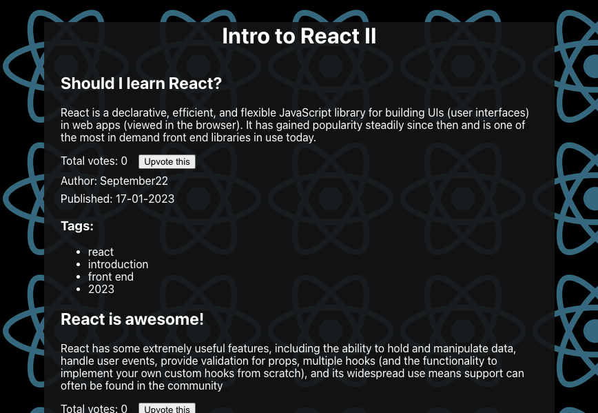

# Intro to React session 2 lecture

This project was bootstrapped with [Create React App](https://github.com/facebook/create-react-app). Its is a simple blog style posts page used to demonstrate the basics of useState, prop types, basic event handlers and a broad intro to working with React in general.

## Setup
*This repo is intended as a guide for a tutor when giving the lecture*

The `main` branch contains the basic application, this can be forked and used as the base for a fresh repo created over the course of a lecture for the students to use when following along with the video recording.

## Finished app

## Available Scripts

Run the app with:

### `npm start`

Open [http://localhost:3000](http://localhost:3000) to view it in your browser.

Run the tests with:
### `npm test`

